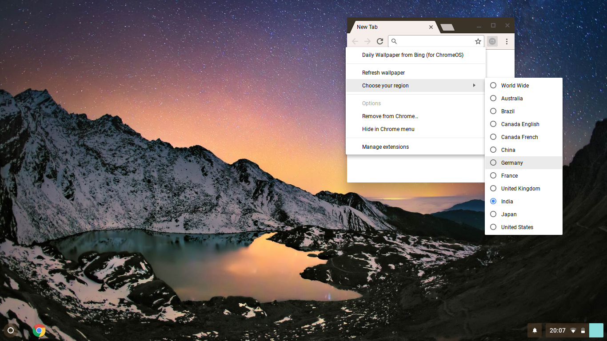

# Daily Wallpaper from Bing (for ChromeOS)  
This chrome extension sets your wallpaper in ChromeOS to Bing's image of the day.
## Installation
1. Download the extension [here](https://raw.github.com/rpbritton/daily-wallpaper-from-bing-for-chromeos/master/daily-wallpaper-from-bing-for-chromeos.crx).
2. Or load the `src` directory of this repository as an unpacked extension in `chrome://extensions`.
3. You may need to install the [Chrome Apps & Extensions Developer Tool](https://chrome.google.com/webstore/detail/chrome-apps-extensions-de/ohmmkhmmmpcnpikjeljgnaoabkaalbgc) if chrome blocks it.
___

